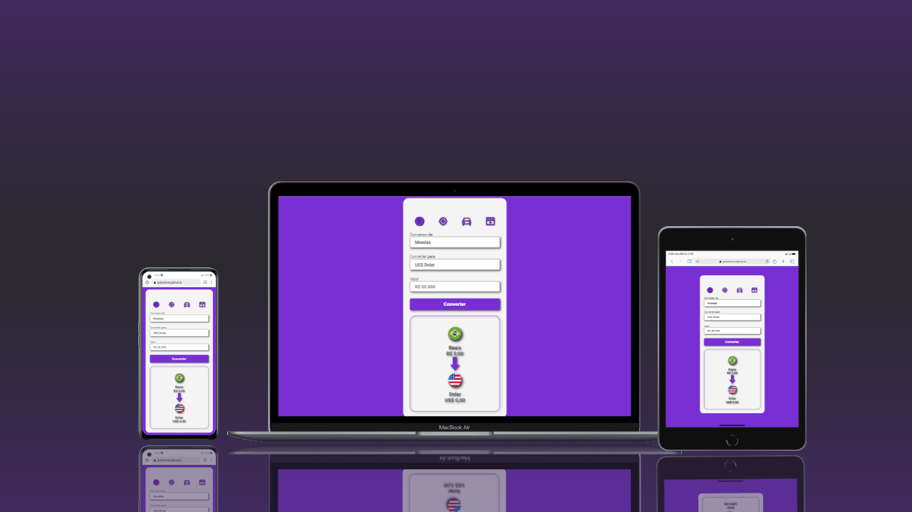

<h1><strong style="font-weight: 700">Projeto<strong> <u><i>Conversores</i></u></h1>
 
 

 
<!-- <ul>
    <h3 >Tecnologias usadas</h3>
    <li></li>
    <li></li>
    <li></li>
</ul> -->
 

## 📝  Sobre

## 🖥 Tecnologias

Este projeto foi desenvolvido com HTML, CSS e JavaScript.

<h3>Confira o resultado acessando <a>Conversores</a> </h3>
 